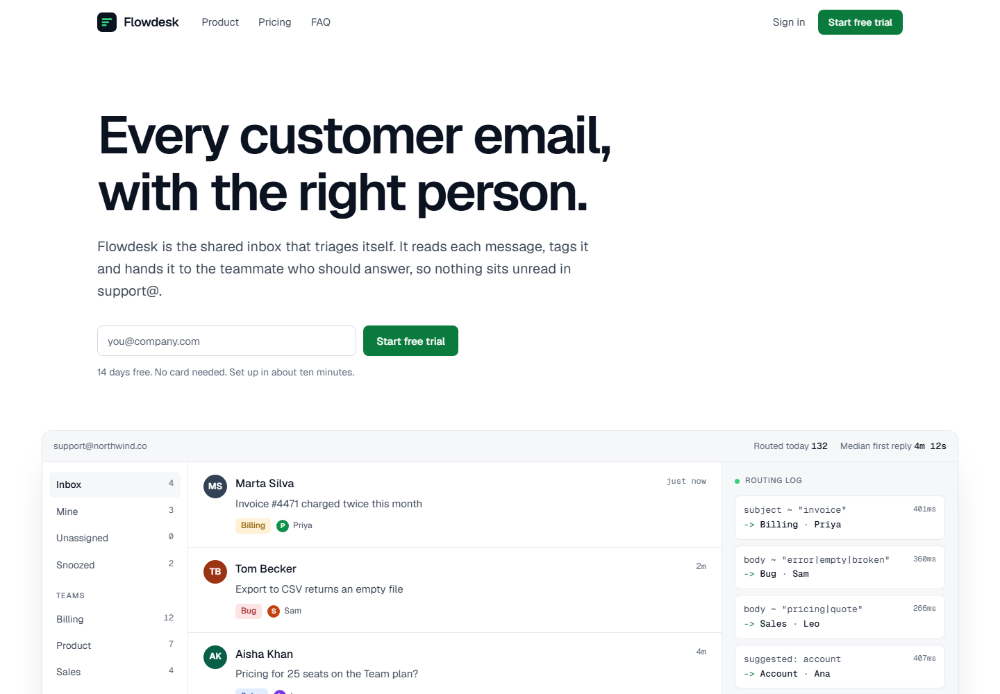

# Flowdesk: SaaS Landing Page Template

A fast, single-page landing page for a software product, with a live product demo in the hero. Plain HTML, CSS and a few lines of JavaScript: no framework, no build step, no dependencies.



> **Flowdesk is a fictional product.** All names, companies, prices, testimonials and figures are sample content for demonstration.

## What's inside

- **Live product demo**: a working inbox in the hero where sample emails arrive and get tagged and assigned automatically. Swap in your own product's story.
- **Sign-up form** with validation, error messages and a loading state (wire it to your email tool or backend).
- **Feature sections** that show the product working instead of icon cards.
- **Pricing table** with a monthly/yearly toggle.
- **FAQ** built with native `<details>`, so it works without JavaScript.
- **Accessible**: semantic HTML, keyboard navigation, visible focus, WCAG AA contrast, skip link, and reduced-motion support.
- **Fast**: one HTML file plus two self-hosted font files (~50 KB). No trackers, no third-party requests.
- **Responsive** from 360px phones to wide desktops.

## Run it locally

Open `index.html` in your browser. That's it.

Or serve it locally:

```bash
npx serve .
```

## Customise

Everything is in `index.html`:

| What | Where |
|---|---|
| Colours, fonts, radius | CSS variables in `:root` at the top of the `<style>` block |
| Copy and sections | The HTML in `<main>` |
| Demo emails | The `mails` array in the `<script>` at the bottom |
| Prices | `data-monthly` / `data-yearly` attributes in the pricing section |
| Sign-up form | The `submit` handler in the `<script>` (currently shows a demo confirmation) |

## Deploy to Cloudflare Pages

No build step needed.

- **Dashboard:** Workers & Pages → Create → Pages → Connect to Git → pick this repo. Build command: *(none)*. Output directory: `/`.
- **CLI:**
  ```bash
  npx wrangler pages deploy . --project-name flowdesk-landing
  ```

## Credits

- Typeface: [Geist](https://vercel.com/font) by Vercel, SIL Open Font License.
- Built by **NC Atelier**.

---

### Want a site like this for your business?

NC Atelier designs and builds fast, accessible websites for businesses in the UK, US and Canada.

**Get in touch:** [ncatelier.com](https://ncatelier.com) · [LinkedIn](https://www.linkedin.com/in/cadetnicolas)
